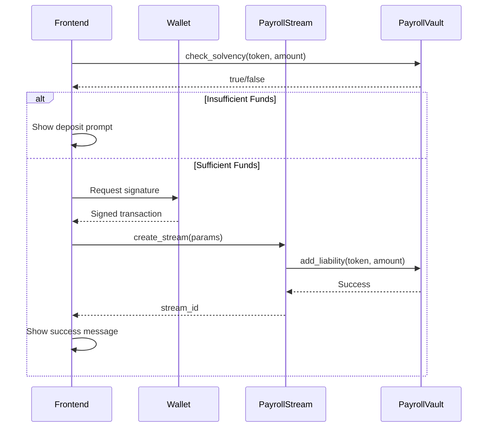
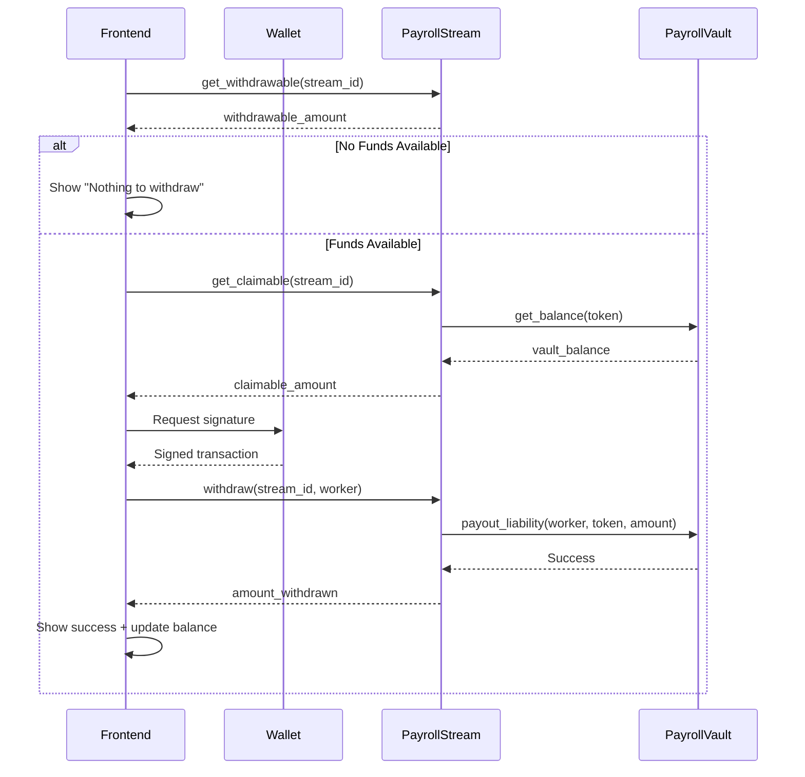
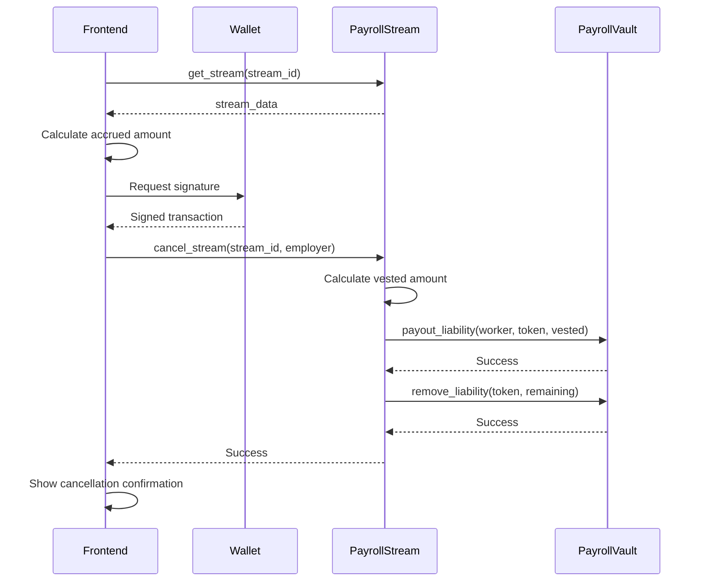

# Contract Interaction Guide for Frontend Developers

This guide provides comprehensive documentation for interacting with Quipay's Soroban smart contracts from the frontend. It covers all contract functions, TypeScript examples, error handling, and common workflows.

## Table of Contents

- [Overview](#overview)
- [Setup](#setup)
- [Contract Architecture](#contract-architecture)
- [PayrollStream Contract](#payrollstream-contract)
- [PayrollVault Contract](#payrollvault-contract)
- [AutomationGateway Contract](#automationgateway-contract)
- [Error Codes Reference](#error-codes-reference)
- [Common Workflows](#common-workflows)
- [Best Practices](#best-practices)

## Overview

Quipay uses three main smart contracts deployed on Stellar's Soroban:

- **PayrollStream**: Manages continuous salary streaming and worker withdrawals
- **PayrollVault**: Handles treasury custody and liability tracking
- **AutomationGateway**: Authorizes AI agents to perform automated actions

All contracts are written in Rust and compiled to WASM. The frontend interacts with them using TypeScript bindings generated from the contract interfaces.

## Setup

### Environment Variables

Configure your `.env` file with contract addresses:

```bash
# Soroban RPC endpoint
VITE_SOROBAN_RPC_URL=https://soroban-testnet.stellar.org

# Network passphrase
VITE_NETWORK_PASSPHRASE=Test SDF Network ; September 2015

# Contract addresses (obtained after deployment)
VITE_PAYROLL_STREAM_CONTRACT_ID=C...
VITE_PAYROLL_VAULT_CONTRACT_ID=C...
VITE_AUTOMATION_GATEWAY_CONTRACT_ID=C...
```

### Installation

```bash
npm install @stellar/stellar-sdk
```

### Basic Imports

```typescript
import {
  Contract,
  rpc as SorobanRpc,
  TransactionBuilder,
  nativeToScVal,
  scValToNative,
  Address,
} from "@stellar/stellar-sdk";
```

## Contract Architecture

```
┌─────────────────────────────────────────────────────────────┐
│                    Frontend (React/TS)                      │
│  • Wallet integration (Freighter)                           │
│  • Transaction building & signing                           │
│  • Contract state queries                                   │
└─────────────────────────────────────────────────────────────┘
                            ↓
┌─────────────────────────────────────────────────────────────┐
│              TypeScript Contract Clients                    │
│  • payroll_stream.ts                                        │
│  • payroll_vault.ts                                         │
│  • automation_gateway.ts                                    │
└─────────────────────────────────────────────────────────────┘
                            ↓
┌─────────────────────────────────────────────────────────────┐
│              Soroban Smart Contracts                        │
│  • PayrollStream (streaming logic)                          │
│  • PayrollVault (treasury custody)                          │
│  • AutomationGateway (AI authorization)                     │
└─────────────────────────────────────────────────────────────┘
```

### Key Concepts

- **Stroops**: Smallest unit of tokens (1 token = 10^7 stroops)
- **ScVal**: Soroban's value type for contract parameters
- **Simulation**: Read-only contract calls that don't require signatures
- **Authorization**: Write operations require wallet signature

## PayrollStream Contract

The PayrollStream contract manages continuous salary streaming with per-second accrual.

### Contract Functions

#### `create_stream`

Creates a new payment stream from employer to worker.

**Parameters:**

- `employer` (Address): Employer's Stellar address (requires auth)
- `worker` (Address): Worker's Stellar address
- `token` (Address): Token contract address (empty for XLM)
- `rate` (i128): Tokens per second in stroops
- `cliff_ts` (u64): Cliff timestamp (0 for no cliff)
- `start_ts` (u64): Stream start timestamp
- `end_ts` (u64): Stream end timestamp

**Returns:** `u64` - Stream ID

**Authorization:** Requires employer signature

**TypeScript Example:**

```typescript
import {
  buildCreateStreamTx,
  submitAndAwaitTx,
} from "./contracts/payroll_stream";
import { signTransaction } from "@stellar/freighter-api";

async function createStream() {
  const params = {
    employer: "GEMPLOYER...",
    worker: "GWORKER...",
    token: "CUSDC...", // or "" for XLM
    rate: BigInt(115740), // ~0.01 tokens/second (in stroops)
    amount: BigInt(100_000_000), // 10 tokens total
    startTs: Math.floor(Date.now() / 1000), // now
    endTs: Math.floor(Date.now() / 1000) + 86400, // 24 hours
  };

  // Build transaction
  const { preparedXdr } = await buildCreateStreamTx(params);

  // Sign with wallet
  const signedXdr = await signTransaction(preparedXdr, {
    networkPassphrase: "Test SDF Network ; September 2015",
  });

  // Submit and wait for confirmation
  const txHash = await submitAndAwaitTx(signedXdr);
  console.log("Stream created! TX:", txHash);
}
```

**Errors:**

- `1005` (InvalidAmount): Rate or amount is zero or negative
- `1021` (InvalidTimeRange): end_ts <= start_ts
- `1022` (InvalidCliff): cliff_ts > end_ts
- `1023` (StartTimeInPast): start_ts < current time
- `1006` (InsufficientBalance): Vault doesn't have enough funds

#### `withdraw`

Worker withdraws accrued earnings from a stream.

**Parameters:**

- `stream_id` (u64): Stream identifier
- `worker` (Address): Worker's address (requires auth)

**Returns:** `i128` - Amount withdrawn in stroops

**Authorization:** Requires worker signature

**TypeScript Example:**

```typescript
import {
  Contract,
  TransactionBuilder,
  nativeToScVal,
  Address,
} from "@stellar/stellar-sdk";
import { signTransaction } from "@stellar/freighter-api";

async function withdrawFromStream(streamId: bigint, workerAddress: string) {
  const server = new SorobanRpc.Server("https://soroban-testnet.stellar.org");
  const account = await server.getAccount(workerAddress);

  const contract = new Contract(PAYROLL_STREAM_CONTRACT_ID);

  const tx = new TransactionBuilder(account, {
    fee: "1000000",
    networkPassphrase: "Test SDF Network ; September 2015",
  })
    .addOperation(
      contract.call(
        "withdraw",
        nativeToScVal(streamId, { type: "u64" }),
        new Address(workerAddress).toScVal(),
      ),
    )
    .setTimeout(30)
    .build();

  const prepared = await server.prepareTransaction(tx);
  const signedXdr = await signTransaction(prepared.toXDR(), {
    networkPassphrase: "Test SDF Network ; September 2015",
  });

  const txResponse = await server.sendTransaction(
    TransactionBuilder.fromXDR(signedXdr, "Test SDF Network ; September 2015"),
  );

  console.log("Withdrawal successful! TX:", txResponse.hash);
}
```

**Errors:**

- `1011` (StreamNotFound): Stream ID doesn't exist
- `1003` (Unauthorized): Caller is not the stream's worker
- `1018` (StreamClosed): Stream is canceled or completed
- `1006` (InsufficientBalance): Vault has insufficient funds

#### `batch_withdraw`

Worker withdraws from multiple streams in a single transaction.

**Parameters:**

- `stream_ids` (Vec<u64>): Array of stream IDs
- `caller` (Address): Worker's address (requires auth)

**Returns:** `Vec<WithdrawResult>` - Array of withdrawal results

**Authorization:** Requires worker signature

**TypeScript Example:**

```typescript
async function batchWithdraw(streamIds: bigint[], workerAddress: string) {
  const server = new SorobanRpc.Server("https://soroban-testnet.stellar.org");
  const account = await server.getAccount(workerAddress);

  const contract = new Contract(PAYROLL_STREAM_CONTRACT_ID);

  // Convert stream IDs to ScVal vector
  const streamIdsScVal = nativeToScVal(streamIds, { type: "Vec<u64>" });

  const tx = new TransactionBuilder(account, {
    fee: "2000000", // Higher fee for batch operation
    networkPassphrase: "Test SDF Network ; September 2015",
  })
    .addOperation(
      contract.call(
        "batch_withdraw",
        streamIdsScVal,
        new Address(workerAddress).toScVal(),
      ),
    )
    .setTimeout(30)
    .build();

  const prepared = await server.prepareTransaction(tx);
  const signedXdr = await signTransaction(prepared.toXDR());

  // Submit and parse results
  const txResponse = await server.sendTransaction(
    TransactionBuilder.fromXDR(signedXdr, "Test SDF Network ; September 2015"),
  );

  console.log("Batch withdrawal complete! TX:", txResponse.hash);
}
```

**Note:** Batch withdrawal is atomic - if any single payout fails, the entire transaction reverts.

#### `cancel_stream`

Employer cancels an active stream, paying out accrued amount to worker.

**Parameters:**

- `stream_id` (u64): Stream identifier
- `caller` (Address): Employer's address (requires auth)
- `gateway` (Option<Address>): Optional gateway address for AI agents

**Returns:** `()` - Success (no return value)

**Authorization:** Requires employer signature

**TypeScript Example:**

```typescript
async function cancelStream(streamId: bigint, employerAddress: string) {
  const server = new SorobanRpc.Server("https://soroban-testnet.stellar.org");
  const account = await server.getAccount(employerAddress);

  const contract = new Contract(PAYROLL_STREAM_CONTRACT_ID);

  const tx = new TransactionBuilder(account, {
    fee: "1000000",
    networkPassphrase: "Test SDF Network ; September 2015",
  })
    .addOperation(
      contract.call(
        "cancel_stream",
        nativeToScVal(streamId, { type: "u64" }),
        new Address(employerAddress).toScVal(),
        nativeToScVal(null), // No gateway
      ),
    )
    .setTimeout(30)
    .build();

  const prepared = await server.prepareTransaction(tx);
  const signedXdr = await signTransaction(prepared.toXDR());

  const txResponse = await server.sendTransaction(
    TransactionBuilder.fromXDR(signedXdr, "Test SDF Network ; September 2015"),
  );

  console.log("Stream canceled! TX:", txResponse.hash);
}
```

**Behavior:**

1. Calculates accrued amount up to cancellation time
2. Pays worker any owed amount
3. Removes remaining liability from vault
4. Charges early cancellation fee (if configured)
5. Marks stream as canceled

**Errors:**

- `1011` (StreamNotFound): Stream ID doesn't exist
- `1003` (Unauthorized): Caller is not the employer
- `1019` (NotEmployer): Caller doesn't own this stream

#### `get_stream` (Read-Only)

Fetches complete stream data by ID.

**Parameters:**

- `stream_id` (u64): Stream identifier

**Returns:** `Option<Stream>` - Stream data or null if not found

**Authorization:** None (read-only)

**TypeScript Example:**

```typescript
import { getStreamById } from "./contracts/payroll_stream";

async function fetchStreamDetails(streamId: bigint, userAddress: string) {
  const stream = await getStreamById(userAddress, streamId);

  if (!stream) {
    console.log("Stream not found");
    return;
  }

  console.log("Stream Details:", {
    employer: stream.employer,
    worker: stream.worker,
    token: stream.token,
    rate: stream.rate, // stroops per second
    startTs: new Date(Number(stream.start_ts) * 1000),
    endTs: new Date(Number(stream.end_ts) * 1000),
    totalAmount: stream.total_amount,
    withdrawnAmount: stream.withdrawn_amount,
    status: stream.status, // 0=Active, 1=Canceled, 2=Completed
  });
}
```

**Stream Status Values:**

- `0` - Active (currently streaming)
- `1` - Canceled (terminated early by employer)
- `2` - Completed (reached end_ts)

#### `get_withdrawable` (Read-Only)

Calculates how much a worker can currently withdraw from a stream.

**Parameters:**

- `stream_id` (u64): Stream identifier

**Returns:** `Option<i128>` - Withdrawable amount in stroops

**Authorization:** None (read-only)

**TypeScript Example:**

```typescript
import { getWithdrawable } from "./contracts/payroll_stream";

async function checkWithdrawableAmount(streamId: bigint) {
  const amount = await getWithdrawable(streamId);

  if (amount === null) {
    console.log("Stream not found or error");
    return;
  }

  // Convert stroops to tokens (divide by 10^7)
  const tokens = Number(amount) / 10_000_000;
  console.log(`Withdrawable: ${tokens} tokens`);

  return amount;
}
```

**Calculation:**

```
withdrawable = vested_amount - withdrawn_amount

where:
  vested_amount = min(rate * elapsed_seconds, total_amount)
  elapsed_seconds = min(now, end_ts) - start_ts
```

#### `get_claimable` (Read-Only)

Returns the actual claimable amount considering vault balance.

**Parameters:**

- `stream_id` (u64): Stream identifier

**Returns:** `Option<i128>` - Claimable amount (min of withdrawable and vault balance)

**Authorization:** None (read-only)

**TypeScript Example:**

```typescript
async function checkClaimableAmount(streamId: bigint) {
  const contract = new Contract(PAYROLL_STREAM_CONTRACT_ID);
  const server = new SorobanRpc.Server("https://soroban-testnet.stellar.org");

  const dummyAccount = await server.getAccount(PAYROLL_STREAM_CONTRACT_ID);

  const tx = new TransactionBuilder(dummyAccount, {
    fee: "100",
    networkPassphrase: "Test SDF Network ; September 2015",
  })
    .addOperation(
      contract.call("get_claimable", nativeToScVal(streamId, { type: "u64" })),
    )
    .setTimeout(10)
    .build();

  const response = await server.simulateTransaction(tx);

  if (SorobanRpc.Api.isSimulationError(response)) {
    console.error("Simulation error:", response.error);
    return null;
  }

  const result = response.result?.retval;
  const claimable = scValToNative(result) as bigint;

  console.log(`Claimable: ${Number(claimable) / 10_000_000} tokens`);
  return claimable;
}
```

**Use Case:** Check if vault has sufficient funds before attempting withdrawal.

#### `is_stream_solvent` (Read-Only)

Checks if vault has enough funds to cover stream's remaining liability.

**Parameters:**

- `stream_id` (u64): Stream identifier

**Returns:** `Option<bool>` - True if solvent, false otherwise

**Authorization:** None (read-only)

**TypeScript Example:**

```typescript
async function checkStreamSolvency(streamId: bigint) {
  const contract = new Contract(PAYROLL_STREAM_CONTRACT_ID);
  const server = new SorobanRpc.Server("https://soroban-testnet.stellar.org");

  const dummyAccount = await server.getAccount(PAYROLL_STREAM_CONTRACT_ID);

  const tx = new TransactionBuilder(dummyAccount, {
    fee: "100",
    networkPassphrase: "Test SDF Network ; September 2015",
  })
    .addOperation(
      contract.call(
        "is_stream_solvent",
        nativeToScVal(streamId, { type: "u64" }),
      ),
    )
    .setTimeout(10)
    .build();

  const response = await server.simulateTransaction(tx);
  const result = response.result?.retval;
  const isSolvent = scValToNative(result) as boolean;

  if (!isSolvent) {
    console.warn("⚠️ Stream is insolvent - vault needs funding!");
  }

  return isSolvent;
}
```

**Use Case:** Monitor treasury health and alert employers before insolvency.

## PayrollVault Contract

The PayrollVault contract manages treasury custody and liability tracking.

### Contract Functions

#### `deposit`

Employer deposits funds into the treasury.

**Parameters:**

- `from` (Address): Depositor's address (requires auth)
- `token` (Address): Token contract address
- `amount` (i128): Amount in stroops

**Returns:** `()` - Success

**Authorization:** Requires depositor signature

**TypeScript Example:**

```typescript
async function depositToVault(
  employerAddress: string,
  tokenAddress: string,
  amount: bigint,
) {
  const server = new SorobanRpc.Server("https://soroban-testnet.stellar.org");
  const account = await server.getAccount(employerAddress);

  const contract = new Contract(PAYROLL_VAULT_CONTRACT_ID);

  const tx = new TransactionBuilder(account, {
    fee: "1000000",
    networkPassphrase: "Test SDF Network ; September 2015",
  })
    .addOperation(
      contract.call(
        "deposit",
        new Address(employerAddress).toScVal(),
        new Address(tokenAddress).toScVal(),
        nativeToScVal(amount, { type: "i128" }),
      ),
    )
    .setTimeout(30)
    .build();

  const prepared = await server.prepareTransaction(tx);
  const signedXdr = await signTransaction(prepared.toXDR());

  const txResponse = await server.sendTransaction(
    TransactionBuilder.fromXDR(signedXdr, "Test SDF Network ; September 2015"),
  );

  console.log("Deposit successful! TX:", txResponse.hash);
}
```

**Errors:**

- `1005` (InvalidAmount): Amount is zero or negative

#### `get_balance` (Read-Only)

Gets the total balance for a token in the vault.

**Parameters:**

- `token` (Address): Token contract address

**Returns:** `i128` - Balance in stroops

**Authorization:** None (read-only)

**TypeScript Example:**

```typescript
import { getVaultBalance } from "./contracts/payroll_vault";

async function checkVaultBalance(tokenAddress: string) {
  const balance = await getVaultBalance(tokenAddress);

  if (balance === null) {
    console.log("Error fetching balance");
    return;
  }

  const tokens = Number(balance) / 10_000_000;
  console.log(`Vault Balance: ${tokens} tokens`);

  return balance;
}
```

#### `get_liability` (Read-Only)

Gets the total liability (committed to streams) for a token.

**Parameters:**

- `token` (Address): Token contract address

**Returns:** `i128` - Liability in stroops

**Authorization:** None (read-only)

**TypeScript Example:**

```typescript
import { getVaultLiability } from "./contracts/payroll_vault";

async function checkVaultLiability(tokenAddress: string) {
  const liability = await getVaultLiability(tokenAddress);

  if (liability === null) {
    console.log("Error fetching liability");
    return;
  }

  const tokens = Number(liability) / 10_000_000;
  console.log(`Total Liability: ${tokens} tokens`);

  return liability;
}
```

#### `get_available_balance` (Read-Only)

Gets the available balance (balance - liability) for a token.

**Parameters:**

- `token` (Address): Token contract address

**Returns:** `i128` - Available balance in stroops

**Authorization:** None (read-only)

**TypeScript Example:**

```typescript
import { getVaultAvailableBalance } from "./contracts/payroll_vault";

async function checkAvailableBalance(tokenAddress: string) {
  const available = await getVaultAvailableBalance(tokenAddress);

  if (available === null) {
    console.log("Error fetching available balance");
    return;
  }

  const tokens = Number(available) / 10_000_000;
  console.log(`Available Balance: ${tokens} tokens`);

  if (available < 0) {
    console.warn("⚠️ Vault is insolvent!");
  }

  return available;
}
```

**Use Case:** Check if employer can create new streams or needs to deposit more funds.

#### `check_solvency` (Read-Only)

Checks if vault can cover an additional liability.

**Parameters:**

- `token` (Address): Token contract address
- `additional_liability` (i128): Amount to check in stroops

**Returns:** `bool` - True if solvent after adding liability

**Authorization:** None (read-only)

**TypeScript Example:**

```typescript
import { checkTreasurySolvency } from "./contracts/payroll_stream";

async function canCreateStream(tokenAddress: string, streamTotal: bigint) {
  const isSolvent = await checkTreasurySolvency(
    PAYROLL_VAULT_CONTRACT_ID,
    tokenAddress,
    streamTotal,
  );

  if (!isSolvent) {
    alert("Insufficient treasury funds. Please deposit more tokens.");
    return false;
  }

  return true;
}
```

## AutomationGateway Contract

The AutomationGateway contract authorizes AI agents to perform automated actions.

### Contract Functions

#### `register_agent`

Admin registers a new AI agent with specific permissions.

**Parameters:**

- `agent_address` (Address): Agent's Stellar address
- `permissions` (Vec<Permission>): Array of permission codes

**Returns:** `()` - Success

**Authorization:** Requires admin signature

**Permission Codes:**

- `1` - ExecutePayroll
- `2` - ManageTreasury
- `3` - RegisterAgent
- `4` - CreateStream
- `5` - CancelStream
- `6` - RebalanceTreasury

**TypeScript Example:**

```typescript
async function registerAgent(
  adminAddress: string,
  agentAddress: string,
  permissions: number[],
) {
  const server = new SorobanRpc.Server("https://soroban-testnet.stellar.org");
  const account = await server.getAccount(adminAddress);

  const contract = new Contract(AUTOMATION_GATEWAY_CONTRACT_ID);

  const tx = new TransactionBuilder(account, {
    fee: "1000000",
    networkPassphrase: "Test SDF Network ; September 2015",
  })
    .addOperation(
      contract.call(
        "register_agent",
        new Address(agentAddress).toScVal(),
        nativeToScVal(permissions, { type: "Vec<u32>" }),
      ),
    )
    .setTimeout(30)
    .build();

  const prepared = await server.prepareTransaction(tx);
  const signedXdr = await signTransaction(prepared.toXDR());

  const txResponse = await server.sendTransaction(
    TransactionBuilder.fromXDR(signedXdr, "Test SDF Network ; September 2015"),
  );

  console.log("Agent registered! TX:", txResponse.hash);
}

// Example: Register agent with stream management permissions
await registerAgent(
  "GADMIN...",
  "GAGENT...",
  [4, 5], // CreateStream, CancelStream
);
```

#### `is_authorized` (Read-Only)

Checks if an agent has a specific permission.

**Parameters:**

- `agent_address` (Address): Agent's address
- `action` (Permission): Permission code to check

**Returns:** `bool` - True if authorized

**Authorization:** None (read-only)

**TypeScript Example:**

```typescript
async function checkAgentPermission(agentAddress: string, permission: number) {
  const contract = new Contract(AUTOMATION_GATEWAY_CONTRACT_ID);
  const server = new SorobanRpc.Server("https://soroban-testnet.stellar.org");

  const dummyAccount = await server.getAccount(AUTOMATION_GATEWAY_CONTRACT_ID);

  const tx = new TransactionBuilder(dummyAccount, {
    fee: "100",
    networkPassphrase: "Test SDF Network ; September 2015",
  })
    .addOperation(
      contract.call(
        "is_authorized",
        new Address(agentAddress).toScVal(),
        nativeToScVal(permission, { type: "u32" }),
      ),
    )
    .setTimeout(10)
    .build();

  const response = await server.simulateTransaction(tx);
  const result = response.result?.retval;
  const isAuthorized = scValToNative(result) as boolean;

  return isAuthorized;
}

// Check if agent can create streams
const canCreateStreams = await checkAgentPermission("GAGENT...", 4);
console.log("Can create streams:", canCreateStreams);
```

## Error Codes Reference

All Quipay contracts use standardized error codes defined in `contracts/common/src/error.rs`.

| Code | Name                    | Description                   | Common Causes                              |
| ---- | ----------------------- | ----------------------------- | ------------------------------------------ |
| 1001 | AlreadyInitialized      | Contract already initialized  | Calling init() twice                       |
| 1002 | NotInitialized          | Contract not initialized      | Calling functions before init()            |
| 1003 | Unauthorized            | Caller not authorized         | Wrong wallet signature                     |
| 1004 | InsufficientPermissions | Agent lacks permission        | Agent not registered or missing permission |
| 1005 | InvalidAmount           | Amount is zero or negative    | Passing 0 or negative values               |
| 1006 | InsufficientBalance     | Not enough funds              | Vault balance < required amount            |
| 1007 | ProtocolPaused          | Contract is paused            | Admin paused operations                    |
| 1008 | VersionNotSet           | Version info missing          | Internal contract error                    |
| 1009 | StorageError            | Storage operation failed      | Internal contract error                    |
| 1010 | InvalidAddress          | Address format invalid        | Malformed Stellar address                  |
| 1011 | StreamNotFound          | Stream ID doesn't exist       | Wrong stream ID or deleted stream          |
| 1012 | StreamExpired           | Stream past end time          | Attempting action on expired stream        |
| 1013 | AgentNotFound           | Agent not registered          | Agent address not in gateway               |
| 1014 | InvalidToken            | Token address invalid         | Malformed token contract address           |
| 1015 | TransferFailed          | Token transfer failed         | Token contract error                       |
| 1016 | UpgradeFailed           | Contract upgrade failed       | Invalid WASM hash or timelock              |
| 1017 | NotWorker               | Caller is not stream worker   | Wrong wallet for withdrawal                |
| 1018 | StreamClosed            | Stream canceled/completed     | Attempting action on closed stream         |
| 1019 | NotEmployer             | Caller is not stream employer | Wrong wallet for cancellation              |
| 1020 | StreamNotClosed         | Stream still active           | Attempting action requiring closed stream  |
| 1021 | InvalidTimeRange        | end_ts <= start_ts            | Invalid stream duration                    |
| 1022 | InvalidCliff            | cliff_ts > end_ts             | Cliff after stream end                     |
| 1023 | StartTimeInPast         | start_ts < current time       | Cannot create past streams                 |
| 1024 | Overflow                | Arithmetic overflow           | Amount too large                           |
| 1025 | RetentionNotMet         | Retention period not met      | Attempting action too early                |
| 1026 | FeeTooHigh              | Fee exceeds maximum           | Cancellation fee > 10%                     |
| 1027 | AddressBlacklisted      | Address is blacklisted        | Compliance restriction                     |
| 1999 | Custom                  | Custom error                  | Generic error fallback                     |

### Error Handling Example

```typescript
import { SorobanRpc } from "@stellar/stellar-sdk";

async function handleContractError(error: any) {
  if (error.message?.includes("1006")) {
    alert("Insufficient treasury balance. Please deposit more funds.");
  } else if (error.message?.includes("1011")) {
    alert("Stream not found. It may have been deleted.");
  } else if (error.message?.includes("1003")) {
    alert("Unauthorized. Please connect the correct wallet.");
  } else if (error.message?.includes("1021")) {
    alert("Invalid time range. End time must be after start time.");
  } else {
    alert(`Transaction failed: ${error.message}`);
  }
}

try {
  await createStream(params);
} catch (error) {
  await handleContractError(error);
}
```

## Common Workflows

### Workflow 1: Create Stream



**Complete TypeScript Implementation:**

```typescript
async function createStreamWorkflow(params: CreateStreamParams) {
  try {
    // Step 1: Check treasury solvency
    const totalAmount = params.rate * BigInt(params.endTs - params.startTs);
    const isSolvent = await checkTreasurySolvency(
      PAYROLL_VAULT_CONTRACT_ID,
      params.token,
      totalAmount,
    );

    if (!isSolvent) {
      // Prompt user to deposit funds
      const depositNeeded = totalAmount; // Calculate exact shortfall
      alert(
        `Please deposit at least ${Number(depositNeeded) / 10_000_000} tokens`,
      );
      return;
    }

    // Step 2: Build transaction
    const { preparedXdr } = await buildCreateStreamTx(params);

    // Step 3: Request wallet signature
    const signedXdr = await signTransaction(preparedXdr, {
      networkPassphrase: "Test SDF Network ; September 2015",
    });

    // Step 4: Submit transaction
    const txHash = await submitAndAwaitTx(signedXdr);

    // Step 5: Parse stream ID from transaction result
    console.log("Stream created successfully! TX:", txHash);

    // Step 6: Refresh UI
    await refreshStreamList();
  } catch (error) {
    await handleContractError(error);
  }
}
```

### Workflow 2: Worker Withdrawal



**Complete TypeScript Implementation:**

```typescript
async function withdrawWorkflow(streamId: bigint, workerAddress: string) {
  try {
    // Step 1: Check withdrawable amount
    const withdrawable = await getWithdrawable(streamId);

    if (!withdrawable || withdrawable === BigInt(0)) {
      alert("No funds available to withdraw yet.");
      return;
    }

    // Step 2: Check claimable (considering vault balance)
    const claimable = await getClaimable(streamId);

    if (!claimable || claimable === BigInt(0)) {
      alert("Vault has insufficient funds. Please contact your employer.");
      return;
    }

    // Step 3: Show confirmation
    const tokens = Number(claimable) / 10_000_000;
    const confirmed = confirm(`Withdraw ${tokens} tokens?`);

    if (!confirmed) return;

    // Step 4: Build and sign transaction
    const server = new SorobanRpc.Server("https://soroban-testnet.stellar.org");
    const account = await server.getAccount(workerAddress);
    const contract = new Contract(PAYROLL_STREAM_CONTRACT_ID);

    const tx = new TransactionBuilder(account, {
      fee: "1000000",
      networkPassphrase: "Test SDF Network ; September 2015",
    })
      .addOperation(
        contract.call(
          "withdraw",
          nativeToScVal(streamId, { type: "u64" }),
          new Address(workerAddress).toScVal(),
        ),
      )
      .setTimeout(30)
      .build();

    const prepared = await server.prepareTransaction(tx);
    const signedXdr = await signTransaction(prepared.toXDR());

    // Step 5: Submit transaction
    const txResponse = await server.sendTransaction(
      TransactionBuilder.fromXDR(
        signedXdr,
        "Test SDF Network ; September 2015",
      ),
    );

    // Step 6: Wait for confirmation
    await waitForConfirmation(txResponse.hash);

    alert(`Successfully withdrew ${tokens} tokens!`);

    // Step 7: Refresh UI
    await refreshStreamDetails(streamId);
  } catch (error) {
    await handleContractError(error);
  }
}
```

### Workflow 3: Cancel Stream



**Complete TypeScript Implementation:**

```typescript
async function cancelStreamWorkflow(streamId: bigint, employerAddress: string) {
  try {
    // Step 1: Fetch stream details
    const stream = await getStreamById(employerAddress, streamId);

    if (!stream) {
      alert("Stream not found.");
      return;
    }

    if (stream.status !== 0) {
      alert("Stream is already closed.");
      return;
    }

    // Step 2: Calculate amounts
    const now = Math.floor(Date.now() / 1000);
    const elapsed =
      Math.min(now, Number(stream.end_ts)) - Number(stream.start_ts);
    const vested = stream.rate * BigInt(elapsed);
    const owed = vested - stream.withdrawn_amount;
    const remaining = stream.total_amount - vested;

    const owedTokens = Number(owed) / 10_000_000;
    const remainingTokens = Number(remaining) / 10_000_000;

    // Step 3: Show confirmation
    const confirmed = confirm(
      `Cancel stream?\n\n` +
        `Worker will receive: ${owedTokens} tokens (accrued)\n` +
        `Returned to treasury: ${remainingTokens} tokens\n\n` +
        `This action cannot be undone.`,
    );

    if (!confirmed) return;

    // Step 4: Build and sign transaction
    const server = new SorobanRpc.Server("https://soroban-testnet.stellar.org");
    const account = await server.getAccount(employerAddress);
    const contract = new Contract(PAYROLL_STREAM_CONTRACT_ID);

    const tx = new TransactionBuilder(account, {
      fee: "1000000",
      networkPassphrase: "Test SDF Network ; September 2015",
    })
      .addOperation(
        contract.call(
          "cancel_stream",
          nativeToScVal(streamId, { type: "u64" }),
          new Address(employerAddress).toScVal(),
          nativeToScVal(null), // No gateway
        ),
      )
      .setTimeout(30)
      .build();

    const prepared = await server.prepareTransaction(tx);
    const signedXdr = await signTransaction(prepared.toXDR());

    // Step 5: Submit transaction
    const txResponse = await server.sendTransaction(
      TransactionBuilder.fromXDR(
        signedXdr,
        "Test SDF Network ; September 2015",
      ),
    );

    // Step 6: Wait for confirmation
    await waitForConfirmation(txResponse.hash);

    alert("Stream canceled successfully!");

    // Step 7: Refresh UI
    await refreshStreamList();
  } catch (error) {
    await handleContractError(error);
  }
}
```

## Best Practices

### 1. Always Simulate Before Submitting

Simulate transactions to catch errors before requesting wallet signatures:

```typescript
async function safeContractCall(operation: any) {
  const server = new SorobanRpc.Server("https://soroban-testnet.stellar.org");
  const account = await server.getAccount(userAddress);

  const tx = new TransactionBuilder(account, {
    fee: "1000000",
    networkPassphrase: "Test SDF Network ; September 2015",
  })
    .addOperation(operation)
    .setTimeout(30)
    .build();

  // Simulate first
  const simulation = await server.simulateTransaction(tx);

  if (SorobanRpc.Api.isSimulationError(simulation)) {
    throw new Error(`Simulation failed: ${simulation.error}`);
  }

  // Only proceed if simulation succeeds
  const prepared = await server.prepareTransaction(tx);
  return prepared;
}
```

### 2. Handle Network Errors Gracefully

```typescript
async function robustContractCall<T>(
  fn: () => Promise<T>,
  retries: number = 3,
): Promise<T> {
  for (let i = 0; i < retries; i++) {
    try {
      return await fn();
    } catch (error: any) {
      if (i === retries - 1) throw error;

      // Retry on network errors
      if (
        error.message?.includes("network") ||
        error.message?.includes("timeout")
      ) {
        await new Promise((resolve) => setTimeout(resolve, 1000 * (i + 1)));
        continue;
      }

      // Don't retry on contract errors
      throw error;
    }
  }
  throw new Error("Max retries exceeded");
}
```

### 3. Cache Read-Only Results

```typescript
class ContractCache {
  private cache = new Map<string, { value: any; expires: number }>();

  async get<T>(
    key: string,
    fetcher: () => Promise<T>,
    ttlMs: number = 30000,
  ): Promise<T> {
    const cached = this.cache.get(key);

    if (cached && cached.expires > Date.now()) {
      return cached.value as T;
    }

    const value = await fetcher();
    this.cache.set(key, {
      value,
      expires: Date.now() + ttlMs,
    });

    return value;
  }
}

const cache = new ContractCache();

// Usage
const balance = await cache.get(
  `vault-balance-${tokenAddress}`,
  () => getVaultBalance(tokenAddress),
  30000, // 30 second TTL
);
```

### 4. Use TypeScript Types

Define strong types for contract data:

```typescript
// Stream status enum
enum StreamStatus {
  Active = 0,
  Canceled = 1,
  Completed = 2,
}

// Stream interface matching contract struct
interface Stream {
  employer: string;
  worker: string;
  token: string;
  rate: bigint;
  cliff_ts: bigint;
  start_ts: bigint;
  end_ts: bigint;
  total_amount: bigint;
  withdrawn_amount: bigint;
  last_withdrawal_ts: bigint;
  status: StreamStatus;
  created_at: bigint;
  closed_at: bigint;
}

// Type guard for stream status
function isStreamActive(stream: Stream): boolean {
  return stream.status === StreamStatus.Active;
}

// Type-safe stream calculations
function calculateVestedAmount(stream: Stream, now: number): bigint {
  if (now < Number(stream.cliff_ts)) {
    return BigInt(0);
  }

  const effectiveTime = Math.min(now, Number(stream.end_ts));
  const elapsed = effectiveTime - Number(stream.start_ts);
  const vested = stream.rate * BigInt(elapsed);

  return vested > stream.total_amount ? stream.total_amount : vested;
}
```

### 5. Implement Proper Loading States

```typescript
function StreamWithdrawButton({ streamId }: { streamId: bigint }) {
  const [isLoading, setIsLoading] = useState(false);
  const [withdrawable, setWithdrawable] = useState<bigint | null>(null);

  useEffect(() => {
    async function fetchWithdrawable() {
      const amount = await getWithdrawable(streamId);
      setWithdrawable(amount);
    }

    fetchWithdrawable();
    const interval = setInterval(fetchWithdrawable, 10000); // Update every 10s

    return () => clearInterval(interval);
  }, [streamId]);

  async function handleWithdraw() {
    setIsLoading(true);
    try {
      await withdrawWorkflow(streamId, workerAddress);
    } catch (error) {
      console.error("Withdrawal failed:", error);
    } finally {
      setIsLoading(false);
    }
  }

  if (withdrawable === null) {
    return <div>Loading...</div>;
  }

  if (withdrawable === BigInt(0)) {
    return <div>No funds available</div>;
  }

  return (
    <button onClick={handleWithdraw} disabled={isLoading}>
      {isLoading ? "Processing..." : `Withdraw ${Number(withdrawable) / 10_000_000} tokens`}
    </button>
  );
}
```

### 6. Monitor Transaction Confirmation

```typescript
async function waitForConfirmation(
  txHash: string,
  maxAttempts: number = 30,
): Promise<void> {
  const server = new SorobanRpc.Server("https://soroban-testnet.stellar.org");

  for (let i = 0; i < maxAttempts; i++) {
    const response = await server.getTransaction(txHash);

    if (response.status === SorobanRpc.Api.GetTransactionStatus.SUCCESS) {
      return;
    }

    if (response.status === SorobanRpc.Api.GetTransactionStatus.FAILED) {
      throw new Error(`Transaction failed: ${txHash}`);
    }

    // Still pending, wait and retry
    await new Promise((resolve) => setTimeout(resolve, 1000));
  }

  throw new Error(`Transaction confirmation timeout: ${txHash}`);
}
```

### 7. Handle BigInt Conversions Carefully

```typescript
// Helper functions for token amount conversions
const STROOPS_PER_TOKEN = 10_000_000;

function tokensToStroops(tokens: number): bigint {
  return BigInt(Math.floor(tokens * STROOPS_PER_TOKEN));
}

function stroopsToTokens(stroops: bigint): number {
  return Number(stroops) / STROOPS_PER_TOKEN;
}

function formatTokenAmount(stroops: bigint, decimals: number = 2): string {
  const tokens = stroopsToTokens(stroops);
  return tokens.toFixed(decimals);
}

// Usage
const userInput = 100.5; // tokens
const stroops = tokensToStroops(userInput);
console.log(`${userInput} tokens = ${stroops} stroops`);

const streamAmount = BigInt(1_000_000_000);
console.log(`Stream amount: ${formatTokenAmount(streamAmount)} tokens`);
```

### 8. Implement Event Listening

```typescript
async function listenForWithdrawalEvents(
  workerAddress: string,
  callback: (event: ContractWithdrawalEvent) => void,
) {
  const server = new SorobanRpc.Server("https://soroban-testnet.stellar.org");
  let lastCheckedLedger = (await server.getLatestLedger()).sequence;

  setInterval(async () => {
    try {
      const currentLedger = (await server.getLatestLedger()).sequence;

      if (currentLedger <= lastCheckedLedger) return;

      const events = await getWorkerWithdrawalEvents(workerAddress);

      // Filter for new events since last check
      const newEvents = events.filter((e) => {
        // Parse ledger from event and compare
        return true; // Implement proper filtering
      });

      newEvents.forEach(callback);
      lastCheckedLedger = currentLedger;
    } catch (error) {
      console.error("Event polling error:", error);
    }
  }, 5000); // Poll every 5 seconds
}

// Usage
listenForWithdrawalEvents("GWORKER...", (event) => {
  console.log(`Withdrawal detected: ${formatTokenAmount(event.amount)} tokens`);
  // Update UI, show notification, etc.
});
```

### 9. Validate User Input

```typescript
function validateStreamParams(params: {
  rate: string;
  startTs: number;
  endTs: number;
  amount: string;
}): { valid: boolean; error?: string } {
  // Validate rate
  const rate = parseFloat(params.rate);
  if (isNaN(rate) || rate <= 0) {
    return { valid: false, error: "Rate must be a positive number" };
  }

  // Validate time range
  const now = Math.floor(Date.now() / 1000);
  if (params.startTs < now) {
    return { valid: false, error: "Start time cannot be in the past" };
  }

  if (params.endTs <= params.startTs) {
    return { valid: false, error: "End time must be after start time" };
  }

  // Validate amount
  const amount = parseFloat(params.amount);
  if (isNaN(amount) || amount <= 0) {
    return { valid: false, error: "Amount must be a positive number" };
  }

  // Validate rate matches duration and amount
  const duration = params.endTs - params.startTs;
  const expectedTotal = rate * duration;
  const tolerance = 0.01; // 1% tolerance for rounding

  if (Math.abs(expectedTotal - amount) > amount * tolerance) {
    return {
      valid: false,
      error: `Rate and duration don't match amount. Expected: ${expectedTotal.toFixed(2)}`,
    };
  }

  return { valid: true };
}

// Usage in form submission
async function handleCreateStream(formData: any) {
  const validation = validateStreamParams(formData);

  if (!validation.valid) {
    alert(validation.error);
    return;
  }

  // Proceed with stream creation
  await createStreamWorkflow(formData);
}
```

### 10. Use Environment-Specific Configuration

```typescript
// config.ts
export const config = {
  rpcUrl:
    import.meta.env.VITE_SOROBAN_RPC_URL ||
    "https://soroban-testnet.stellar.org",
  networkPassphrase:
    import.meta.env.VITE_NETWORK_PASSPHRASE ||
    "Test SDF Network ; September 2015",
  contracts: {
    payrollStream: import.meta.env.VITE_PAYROLL_STREAM_CONTRACT_ID || "",
    payrollVault: import.meta.env.VITE_PAYROLL_VAULT_CONTRACT_ID || "",
    automationGateway:
      import.meta.env.VITE_AUTOMATION_GATEWAY_CONTRACT_ID || "",
  },
  isTestnet: import.meta.env.VITE_NETWORK_PASSPHRASE?.includes("Test") ?? true,
};

// Validate configuration on app startup
export function validateConfig(): void {
  if (!config.contracts.payrollStream) {
    console.warn("⚠️ VITE_PAYROLL_STREAM_CONTRACT_ID not set");
  }

  if (!config.contracts.payrollVault) {
    console.warn("⚠️ VITE_PAYROLL_VAULT_CONTRACT_ID not set");
  }

  if (config.isTestnet) {
    console.log("🧪 Running on Testnet");
  } else {
    console.log("🚀 Running on Mainnet");
  }
}
```

## Additional Resources

### Official Documentation

- [Stellar Developers](https://developers.stellar.org/) - Stellar platform documentation
- [Soroban Docs](https://soroban.stellar.org/docs) - Smart contract development guide
- [Stellar SDK](https://stellar.github.io/js-stellar-sdk/) - JavaScript SDK reference

### Quipay Documentation

- [Architecture Decision Records](./adr/) - Design rationale and architectural decisions
- [Security Threat Model](./SECURITY_THREAT_MODEL.md) - Security analysis and mitigations
- [Product Requirements](./PRD.md) - Complete product specification
- [DAO Treasury Setup](./DAO_TREASURY_SETUP.md) - Multisig configuration guide

### Contract Source Code

- [PayrollStream Contract](../contracts/payroll_stream/src/lib.rs) - Streaming logic implementation
- [PayrollVault Contract](../contracts/payroll_vault/src/lib.rs) - Treasury management implementation
- [AutomationGateway Contract](../contracts/automation_gateway/src/lib.rs) - AI authorization implementation
- [Common Errors](../contracts/common/src/error.rs) - Error definitions

### Frontend Integration Examples

- [Stream Contract Client](../src/contracts/payroll_stream.ts) - TypeScript bindings
- [Vault Contract Client](../src/contracts/payroll_vault.ts) - TypeScript bindings
- [usePayroll Hook](../src/hooks/usePayroll.ts) - React integration example
- [Stream Creator Component](../src/components/StreamCreator.tsx) - UI component example

### Testing

```bash
# Test contracts
cd contracts/payroll_stream
cargo test

# Test frontend integration
npm test

# Run integration tests
npm run test:integration
```

### Getting Help

- **GitHub Issues**: [Report bugs or request features](https://github.com/LFGBanditLabs/Quipay/issues)
- **Discussions**: [Ask questions and share ideas](https://github.com/LFGBanditLabs/Quipay/discussions)
- **Contributing**: See [CONTRIBUTING.md](../CONTRIBUTING.md) for contribution guidelines

---

**Last Updated:** March 2026

**Maintainers:** Quipay Core Team

**License:** Apache 2.0
